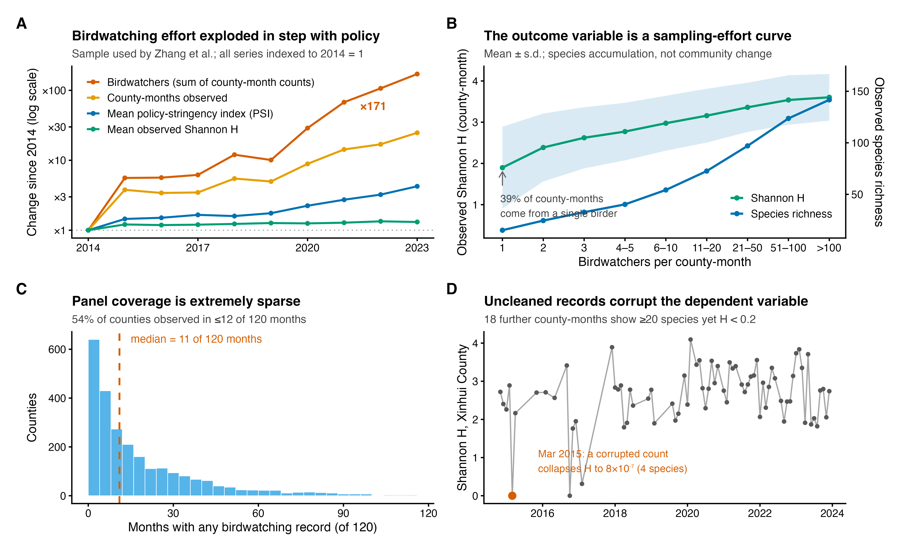
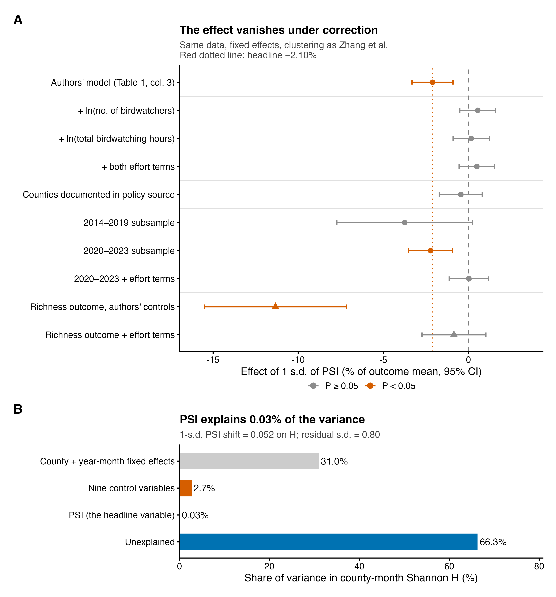
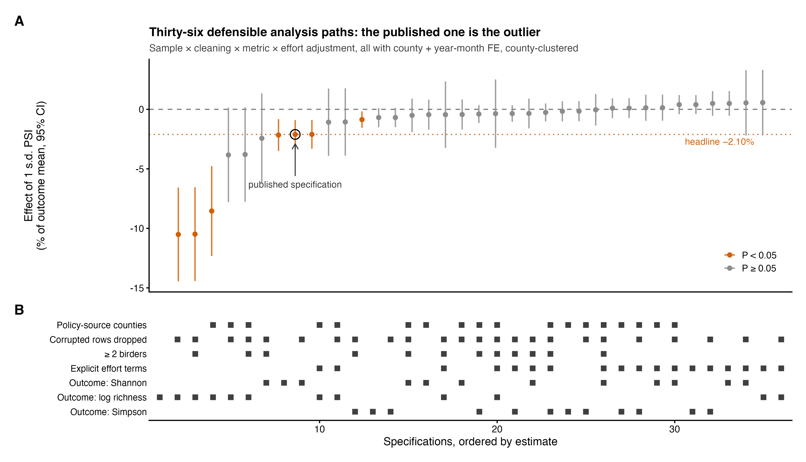

# Technical Comment 中文对照版(供修改与内部讨论;投稿以英文版为准)

**对《中国光伏扩张政策降低鸟类多样性》(Zhang et al., *Science* 393:831–836, 2026)的技术评论**

丁晨晨(北京大学)

---

## 摘要(对应英文 49 词)

Zhang 等(Research Articles,2026 年 8 月 21 日)报告光伏政策强度降低了中国县级鸟类多样性。基于其公开复现数据的重分析显示:其因变量追踪的是观鸟努力而非鸟类群落;校正努力、数据污染与未经验证的政策零值后,报告的效应完全消失。

---

## 正文

Zhang 等(*1*)将光伏政策强度指数(PSI)与聚合到县-月尺度的公民科学观鸟记录相联系,得出"政策强度每上升一个标准差,香农多样性下降 2.10%"的结论。该发现配有专文评述(*2*),已被广泛报道为中国光伏扩张损害鸟类的证据。利用作者公开的复现包,我们精确复现了其首选估计(β = −0.0125,县级聚类标准误 0.0037,n = 46,371)。然而,复现过程暴露出三个问题——分别涉及**测量、混淆与推断**——其中任何一个单独成立,都足以推翻该结论。

**因变量度量的是观测过程。** 公民科学记录由两个过程共同生成:物种在哪里、有多少的**状态过程**,经由谁在看、在哪看、何时看的**观测过程**过滤后呈现;分类学、时间与空间三重检测偏差,意味着原始记录不能直接读作物种的真实占域与丰度(*4*, *7*)。本文的因变量是每个县-月内非结构化观鸟报告算出的香农指数。在估计样本中,38.8% 的县-月仅来自单独一名观鸟者;县的观测覆盖中位数仅为 120 个月中的 11 个月(图 1C)。观测到的物种丰富度与香农多样性是观鸟人数的陡峭饱和函数(图 1B):单人观测的县-月平均记录 15 种(H = 1.90),超过 100 人观测的县-月平均记录 142 种(H = 3.60)。这一梯度必然部分反映真实差异,因为观鸟者会聚集在鸟多的地方与季节;但两项判别性证据表明,抽样累积主导了它。其一,在固定群落的模拟中(补充材料),仅清单型记录方式就能复现观测 H 随努力上升。其二,在我们的复现中,均匀度随努力单调下降(单人 0.84,百人以上 0.73):真实的多样性梯度并不预期均匀度持续走低,而清单变长会以低计数加入稀有种,机械地压低均匀度。作者自己的结果携带同一签名:PSI 对应更低的观测丰富度、更高的均匀度(其表 S19),这正是清单变短的产物。

输入数据同样未经验证。在我们项目持有的记录级平台数据中,2014–2023 年有 46,997 / 100,313 份清单(46.9%)所有计数均为 1(平台原始 2024 省级交付中为 123,232 / 282,197 份,43.7%;其计数列经我们验证确为物种个体数)。这类"清单型"记录不携带丰度信息:把每个物种一律计为 1 只,会虚增稀有种的权重、压低真实的优势种,把香农指数推向对数丰富度;近半原始材料度量的是清单长度,而非群落结构。受污染的计数还直接进入了已发表的分析:广东新会区 2015 年 3 月的香农值为 8 × 10⁻⁷,而该月记录了四个物种(相邻月份为 2.2–2.9)——算术上,这样的取值要求某单一物种的计数至少达到千万量级。这一数值作为因变量的一个观测**直接进入了回归**(图 1D)。另有 18 个县-月同时呈现"记录物种数 ≥20 而 H < 0.2"的相同污染签名。文(*1*)未描述任何数据质控步骤。

**观鸟努力与处理变量相混淆。** 在估计样本内,观鸟者人数合计在 2014–2023 年间增长了 171 倍,有观测的县-月数增长 25 倍,而这正是 PSI 均值翻两番的时期(图 1A)。作者仅控制了 `Duration`——**人均**观鸟小时数的对数——这一比率变量抹去了总努力的爆发式增长。更严重的是,`Duration` 本身响应 PSI(β = −0.0177,P < 10⁻⁴),使其成为条件化于处理后变量的"坏控制"(*3*)。将观鸟人数作为**阴性对照结果变量**可直接暴露该设计的失灵:PSI"减少"观鸟者(β = −0.041,P = 2 × 10⁻¹¹)。这不是政策的行为效应——该关联在政策文件记录县内缩水 81%(β = −0.008,P = 0.17);在控制当年 PSI 后,**明年的 PSI"影响"今天的观鸟人数**(β = −0.045,P < 10⁻⁵)——因果不可能的时间方向,识别出县级差异趋势;且 PSI 在县内并不预测实际光伏面积(P = 0.27),切断了"施工扰动"通道。一个连"未来政策会移动非生态结果变量"都会发生的设计,对任何结果变量——包括鸟——都会制造"效应"。

补救方法在公民科学文献中是标准做法:显式建模观测过程(*4*–*7*)。仅在作者自己的规格中加入 ln(观鸟人数)——同样的数据、固定效应与聚类——PSI 系数即翻转为 +0.0032(P = 0.31);加入 ln(总时长)或同时加入两项,结果同样为零(图 2A)。其表 S19 中每单位 PSI 减少 0.98 个物种的丰富度效应,在同一校正下缩水 92% 至 −0.07(P = 0.37)。分时段估计证实了诊断:效应在 2020 年观鸟爆发之前仅为边缘显著(P = 0.066),而在 2020–2023 年内,一旦控制努力便完全消失(β = +0.0002,P = 0.96)。

**估计本身脆弱,且按其表面值亦可忽略。** 政策变量同样有问题:2,344 个样本县中有 703 个(占观测量的 43.9%)从未出现在政策文本源中,其 PSI 被填补为零——尽管该源数据本身区分了真实的零值。将面板限制在政策源中确有记录的县,得到 β = −0.0027(P = 0.49)。即便按其表面值,PSI 对模型 R² 的独立增量仅 0.0003——即香农多样性方差的 0.03%,而固定效应吸收了 31%(图 2B)——其隐含的一个标准差冲击(H 变化 0.052)仅为残差标准差(0.80)的 6.5%。在 46,371 个来自受污染、努力驱动的因变量的观测中,如此大小的"统计显著"系数不携带任何生态学信息(*8*, *9*)。

为确定数据究竟支持什么,我们将所有可辩护的分析决策做全交叉——样本(全样本 vs 政策文件记录县)、清洗(照原文;剔除污染行;≥2 名观鸟者)、结果指标(Shannon、Simpson、对数丰富度)、努力校正——共 36 个规格(图 S1)。全部 7 个显著负估计均来自**未含努力项**的路径;全部 18 个努力校正路径均为零效应(中位数 +0.10%/标准差;范围 −1.08% 至 +0.56%)。我们的首选估计——剔除污染记录、限于政策记录县、显式努力项——香农多样性为 **+0.14%(95% CI:−0.96% 至 +1.24%)**,该区间**排除了已发表的 −2.10%**。

**含义。** 我们的重分析并不表明光伏开发对鸟类无害;地面光伏可能置换栖息地,严格的影响研究非常必要。它表明的是:该数据集在该设计下,无论哪个方向的效应都无法检测——这一区分具有政策后果。论文的亚组结果(荒漠县不显著)已被解读为支持将吉瓦级开发集中于干旱区,而荒漠恰是公民科学覆盖最稀疏之处;证据的缺席不是影响缺席的证据。公民科学正在变革中国的生物多样性监测,但基于它的分析必须显式建模检测与努力——通过占据模型、清单长度校正或带质控记录的半结构化方案(*4*–*7*, *10*)——并在异常记录进入全国尺度的因变量之前进行验证。更广的警示在于:在公民科学记录支撑全国尺度的因果结论之前,必须先确认其数据缺陷,并论证其对所研究问题的适用性。

---

## 图(中文图注)

**图 1. Zhang 等的因变量度量的是观测过程,而非鸟类群落。**
(A)在作者估计样本内,观鸟者合计人数(红)2014–2023 年增长 171 倍,有观测县-月数(橙)增长 25 倍,同期政策强度均值(蓝)翻两番;观测到的香农 H 均值(绿)随之上升。所有序列以 2014 = 1 标准化,对数坐标。(B)观测香农 H(绿,左轴;均值 ± 标准差)与物种丰富度(蓝,右轴)对县-月观鸟人数的关系:一条物种累积曲线。38.8% 的县-月来自单独一名观鸟者。(C)各县有观鸟记录的月数(共 120 个月)分布;中位数 11。(D)广东新会区月度香农 H:一条受污染的记录使 2015 年 3 月坍缩至 H = 8 × 10⁻⁷(当月记录 4 个物种;算术上要求单种计数至少千万量级),且未经过滤进入回归;另有 18 个县-月呈"≥20 种而 H < 0.2"的同类签名。

**图 2. 报告的政策效应在校正后消失,且量级可忽略。**
(A)一个标准差 PSI 的效应(以结果均值的百分比表示,95% CI),作者精确规格与最小校正的对比(同一数据、县与年-月固定效应、县级聚类)。加入总努力项、限于政策文件记录县、或分时段估计均使效应消失;丰富度结果(三角)在努力控制下缩水 92%。红色点线:头条 −2.10%。(B)县-月香农 H 的方差账本:县与年-月固定效应吸收 31.0%,九个控制变量 2.7%,而 PSI——头条变量——仅 0.03%,66.3% 未被解释。

**图 S1(补充). 36 条可辩护分析路径的规格曲线。**
样本 × 清洗 × 指标 × 努力校正的全交叉估计(以结果均值的百分比/标准差表示,95% CI),按估计值排序;下面板标示每条路径的决策。全部 7 个显著负估计(橙)出现于无努力项的路径;全部 18 条努力校正路径为零效应。空心圆为已发表规格。

---

## 关键数字速查表(全部可由 output/ 目录 CSV 溯源)

| 量 | 数值 | 来源文件 |
|---|---|---|
| 原文主估计(精确复现) | β = −0.01253,SE = 0.00366,N = 46,371 | table1_replication.csv |
| 头条换算 | −0.0125 × SD(PSI)=4.116 ÷ mean(H)=2.446 = −2.108% | 同上 |
| + ln(观鸟人数) | +0.0032,P = 0.31 | spec_results.csv |
| PSI → ln(观鸟人数) | −0.041,P = 2×10⁻¹¹ | spec_results.csv |
| PSI → ln(总时长) | −0.057,P = 3×10⁻¹³ | spec_results.csv |
| PSI → Duration(作者控制变量) | −0.0177,P = 2.8×10⁻⁵ | spec_results.csv |
| PSI → ln(观鸟人数),仅政策记录县 | −0.008,P = 0.17(缩水 81%) | negative_control.csv |
| 明年 PSI → 今天观鸟人数(控当年) | −0.045,P = 1.5×10⁻⁶(预趋势证据) | negative_control.csv |
| PSI → 实际光伏面积(县内) | −0.017,P = 0.27(政策不预测建设) | negative_control.csv |
| PSI → ln(夜光)(第二阴性对照) | −0.0017,P = 0.24(干净) | negative_control.csv |
| Shannon ~ PSI + 县级线性趋势 | −0.0079,P = 0.10(头条失显著) | negative_control.csv |
| 政策源县子样本 | −0.0027,P = 0.49,N = 26,007 | spec_results.csv |
| 政策填零县 | 703/2,344 县,43.9% 观测 | 01/05 脚本输出 |
| 丰富度效应及努力校正 | −0.975*** → −0.073(P = 0.37),缩水 92% | spec_results.csv |
| PSI 的 R² 独立增量 | 0.000317(方差的 0.03%) | r2_decomposition.csv |
| 信号/噪声 | 0.052 / 0.80 = 6.5% | 02 脚本输出 |
| 单人县-月占比 | 38.8%(17,975/46,371) | 02 脚本输出 |
| 县覆盖中位数 | 11/120 个月;54% 县 ≤12 个月 | county_coverage.csv |
| 观鸟人数增长 | 783 → 134,143(×171) | effort_annual.csv |
| 污染县-月 | 新会 2015-03 H=8.06×10⁻⁷;另 18 个签名行 | pathology_cases/scan.csv |
| 36 规格结论 | 7 显著负全部无努力项;18 努力校正全为零 | spec_curve.csv |
| 首选校正估计(Shannon) | +0.14%,95% CI [−0.96%, +1.24%],排除 −2.10% | final_estimate.csv |
