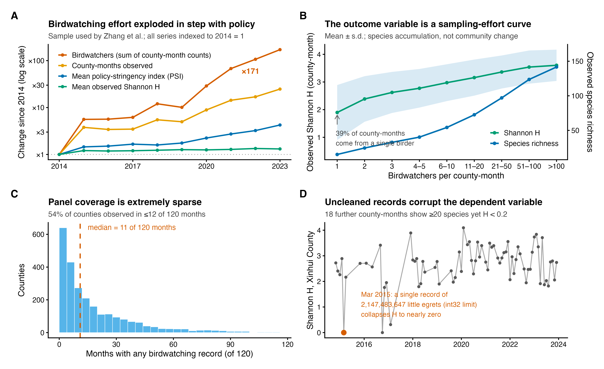

# Comment on "China's solar expansion policy reduces bird diversity"

**One-sentence summary:** The reported decline in bird diversity under China's solar-expansion policy reflects birdwatching effort, not bird communities, and vanishes under standard corrections.

## Abstract

Zhang *et al*. report that solar-policy stringency reduced county-level bird diversity across China. Reanalyzing their public replication data, we show their outcome variable tracks birdwatching effort rather than bird communities; correcting effort, data contamination, and unvalidated policy zeros eliminates the reported effect entirely.

## Main Text

Zhang *et al*. (*1*) link a photovoltaic policy-stringency index (PSI) to citizen-science bird records aggregated to county-months and conclude that a one-standard-deviation policy increase reduced Shannon diversity by 2.10%. The finding, accompanied by a Perspective (*2*), has been widely reported as evidence that solar expansion harms birds. Using the authors' public replication package, we reproduce their preferred estimate exactly (β = −0.0125, clustered SE = 0.0037, *n* = 46,371). The reproduction, however, exposes problems of measurement, confounding, and inference, each of which independently undermines the conclusion.

**The outcome variable measures the observation process.** Citizen-science records reflect a state process (where species occur, in what numbers) filtered through an observation process (who looks, where, when): taxonomic, temporal, and spatial detection biases mean raw records cannot be read as true occupancy or abundance (*4*, *7*). The dependent variable here is a Shannon index computed from unstructured birdwatching reports within each county-month. In the estimation sample, 38.8% of county-months rest on a single birdwatcher and the median county is observed in 11 of 120 months (Fig. 1C). Observed richness and Shannon diversity are steep, saturating functions of the number of birdwatchers present (Fig. 1B): county-months with one birder average 15 species (H = 1.90), while those with \>100 birders average 142 species (H = 3.60). Part of this gradient surely reflects real differences, because birdwatchers congregate where and when birds are plentiful; two diagnostics nevertheless show that sampling accumulation dominates it. In simulations that hold the community fixed (supplementary materials), checklist-type recording alone reproduces the rise of observed H with effort. And evenness declines monotonically with effort in our reproduction (0.84 at one birder; 0.73 above 100): genuine diversity gradients carry no expectation of ever-declining evenness, whereas lengthening lists add rare species at low counts and depress it mechanically. The authors' own results carry the same signature: PSI associates with lower observed richness but higher evenness (their table S19), exactly what shorter species lists produce.

The input data are also unvalidated. In record-level platform data held by our own project, every count equals one in 46,997 of 100,313 checklists from 2014--2023 (46.9%; 43.7% in the platform's raw 2024 delivery, whose count field we verified as genuine abundance). These checklist-type records carry no abundance information: treating every species as one individual inflates the weight of rare species, suppresses true dominants, and drives the Shannon index toward log richness, so nearly half of the raw material measures list length rather than community structure. Corrupted counts also reach the published analysis directly: the Shannon value for Xinhui County in March 2015 is 8 × 10⁻⁷ with four species recorded, against 2.2--2.9 in adjacent months; arithmetically, such a value requires a single species count of at least tens of millions. This entry enters the regression as an observation of the dependent variable (Fig. 1D). Eighteen more county-months share this signature (≥20 species, H \< 0.2). No data-quality screening is described in (*1*).

**Birdwatching effort is confounded with the treatment.** Summed birdwatcher counts grew 171-fold over 2014--2023 and observed county-months 25-fold, precisely as mean PSI quadrupled (Fig. 1A). The authors control only for `Duration`, the logarithm of birdwatching hours per birder, a ratio that discards the explosive growth in total effort. `Duration` is itself a post-treatment variable, responding to PSI (β = −0.0177, *P* \< 10⁻⁴); conditioning on it is a classic "bad control" (*3*). Birdwatcher numbers serve as a negative-control outcome: PSI "reduces" birdwatchers (β = −0.041, *P* = 2 × 10⁻¹¹), an association unlikely to reflect birdwatcher behaviour. The association shrinks by 81% within policy-documented counties (β = −0.008, *P* = 0.17); next-year PSI "affects" current birdwatchers conditional on current PSI (β = −0.045, *P* \< 10⁻⁵), a causally impossible direction that indicates differential county trends; and PSI does not predict realized PV area within counties (*P* = 0.27), which weakens any construction-disturbance pathway. A design in which future policy shifts a non-ecological outcome can generate spurious effects for any outcome, including birds.

The remedy is standard: model the observation process explicitly (*4*--*7*). Within the authors' own specification (same data, fixed effects, and clustering), adding ln(birdwatchers) flips the PSI coefficient to +0.0032 (*P* = 0.31); adding ln(total hours) or both terms gives the same null (Fig. 2A). The richness decline of −0.98 species per PSI unit (their table S19) shrinks by 92% to −0.07 (*P* = 0.37), and the corrected effect within the 2020--2023 boom is +0.0002 (*P* = 0.96).

**The estimate is fragile and, at face value, negligible.** The policy variable is equally problematic: 703 of 2,344 sample counties (43.9% of observations) never appear in the policy-text source, and their PSI is imputed as zero although the source distinguishes true zeros. Restricting to policy-documented counties yields β = −0.0027 (*P* = 0.49). Even taken at face value, PSI adds 0.0003 to the model's R², or 0.03% of the variance in Shannon diversity, against 31% absorbed by fixed effects (Fig. 2B); the implied one-standard-deviation shift (0.052 on H) is 6.5% of the residual standard deviation (0.80). A statistically significant coefficient of this size, estimated from a contaminated, effort-driven outcome, carries little ecological information (*8*, *9*).

To establish what the data do support, we estimated all 36 combinations of sample (full or policy-documented), cleaning (as published, corrupted rows removed, or ≥2 birders), metric (Shannon, Simpson, log richness), and effort adjustment (fig. S1). All seven significant negative estimates come from paths without effort terms; all 18 effort-adjusted paths are null (median +0.10%). Our preferred estimate (corrupted records removed, policy-documented counties, explicit effort terms) is +0.14% for Shannon diversity (95% CI, −0.96 to +1.24%), an interval that excludes the published −2.10%. Had that effect been real, this corrected design would have detected it with 96% power.

**Implications.** Our reanalysis does not show that photovoltaic development is harmless; ground-mounted solar can displace habitat and warrants rigorous impact studies. It shows that this dataset, under this design, cannot detect such an effect in either direction. The subgroup results (no significant effect in desert counties) are already being read as support for concentrating gigawatt-scale development in arid lands, yet deserts are where citizen-science coverage is sparsest; absence of evidence is not evidence of absence. Birdwatching records can support diversity inference under explicit conditions: effort-standardized richness, a presence-based quantity, is defensible with coverage-based rarefaction, list-length corrections, or occupancy models (*4*--*7*, *9*, *10*), whereas abundance-weighted indices such as Shannon additionally require complete checklists, validated counts, and detection-heterogeneity corrections. None of these conditions is met here. The broader caution stands: data defects and fitness for purpose must be established before citizen-science records anchor national-scale causal claims.

## References and Notes

1.  H. Zhang, A. Zhang, K. Wu, Y. Cai, S. Li, S. Wang, Y. Qiu, S. Huang, T. T. A. Phan, China's solar expansion policy reduces bird diversity. *Science* **393**, 831--836 (2026). doi:10.1126/science.aee0747
2.  Y. Liang, Beyond carbon in renewable energy policy. *Science* **393**, 758--759 (2026).
3.  C. Cinelli, A. Forney, J. Pearl, A crash course in good and bad controls. *Sociol. Methods Res.* **53**, 1071--1104 (2024).
4.  A. Johnston, W. M. Hochachka, M. E. Strimas-Mackey, V. Ruiz Gutierrez, O. J. Robinson, E. T. Miller, T. Auer, S. T. Kelling, D. Fink, Analytical guidelines to increase the value of community science data. *Divers. Distrib.* **27**, 1265--1277 (2021).
5.  S. Kelling, A. Johnston, A. Bonn, D. Fink, V. Ruiz-Gutierrez, R. Bonney, M. Fernandez, W. M. Hochachka, R. Julliard, R. Kraemer, R. Guralnick, Using semistructured surveys to improve citizen science data for monitoring biodiversity. *BioScience* **69**, 170--179 (2019).
6.  N. J. B. Isaac, A. J. van Strien, T. A. August, M. P. de Zeeuw, D. B. Roy, Statistics for citizen science: extracting signals of change from noisy ecological data. *Methods Ecol. Evol.* **5**, 1052--1060 (2014).
7.  D. I. MacKenzie, J. D. Nichols, G. B. Lachman, S. Droege, J. A. Royle, C. A. Langtimm, Estimating site occupancy rates when detection probabilities are less than one. *Ecology* **83**, 2248--2255 (2002).
8.  L. Jost, Entropy and diversity. *Oikos* **113**, 363--375 (2006).
9.  A. Chao, N. J. Gotelli, T. C. Hsieh, E. L. Sander, K. H. Ma, R. K. Colwell, A. M. Ellison, Rarefaction and extrapolation with Hill numbers: a framework for sampling and estimation in species diversity studies. *Ecol. Monogr.* **84**, 45--67 (2014).
10. J. K. Szabo, P. A. Vesk, P. W. J. Baxter, H. P. Possingham, Regional avian species declines estimated from volunteer-collected long-term data using List Length Analysis. *Ecol. Appl.* **20**, 2157--2169 (2010).

## Acknowledgments

**Funding:** The author received no specific funding for this work.

**Data and materials availability:** All analyses use the original authors' public replication package (github.com/jianke22/China-s-solar-expansion-policy-reduces-bird-diversity). R scripts, derived tables, and figure source data reproducing every number in this Comment are openly available at github.com/dingchenchen6/reanalysis-zhang2026-solar-birds; the record-level China Birdwatching Record Center dataset used for species-level verification is archived in the repository's releases. The full archive will be deposited with a DOI upon acceptance.

## Supplementary Materials

Materials and Methods; Figs. S1 and S2; Tables S1 and S2.

## Figure Legends

**Fig. 1. The dependent variable of Zhang *et al*. measures the observation process, not bird communities.** (**A**) Within the authors' estimation sample, summed birdwatcher counts (red) grew 171-fold during 2014--2023 and observed county-months (orange) 25-fold, while mean policy stringency (blue) quadrupled; mean observed Shannon H (green) rose accordingly. All series indexed to 2014 = 1, log scale. (**B**) Observed Shannon H (green, left axis; mean ± s.d.) and species richness (blue, right axis) against the number of birdwatchers per county-month: a species-accumulation curve. 38.8% of county-months derive from a single birder. (**C**) Distribution of the number of months (of 120) in which each county has any birdwatching record; median 11. (**D**) Monthly Shannon H for Xinhui County, Guangdong: a corrupted entry collapses March 2015 to H = 8 × 10^−7^ with four species recorded (adjacent months, 2.2--2.9), a value that arithmetically requires a single species count of at least tens of millions; it enters the regression unfiltered. Eighteen further county-months show ≥20 species yet H \< 0.2.

**Fig. 2. The reported policy effect vanishes under correction and is negligible in magnitude.** (**A**) Effect of a one-standard-deviation PSI increase, expressed as % of the outcome mean with 95% CIs, under the authors' exact specification and minimal corrections (identical data, county and year-month fixed effects, county-clustered SEs). Adding total-effort terms, restricting to counties documented in the policy source, or splitting by period eliminates the effect; the richness outcome (triangles) shrinks 92% under effort control. Red dotted line: the headline −2.10%. (**B**) Variance ledger for county-month Shannon H: county and year-month fixed effects absorb 31.0%, the nine controls 2.7%, and PSI, the headline variable, 0.03%, with 66.3% unexplained.

**Fig. 1.**

**Fig. 2.**
