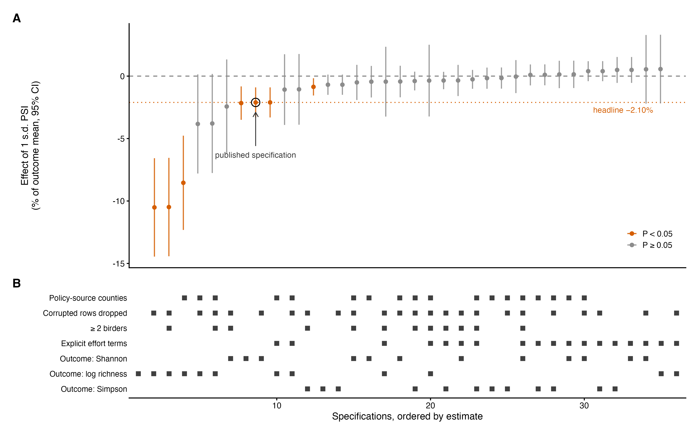
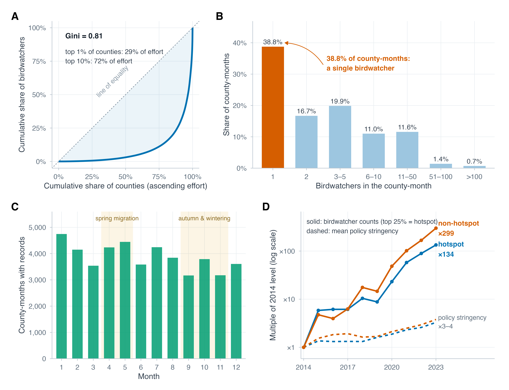

# Supplementary Materials for

## Comment on "China's solar expansion policy reduces bird diversity"

Chenchen Ding. Correspondence to: dingchenchen@pku.edu.cn

**This PDF file includes:** Materials and Methods; Figs. S1 and S2; Tables S1 and S2.

## Materials and Methods

**Data and exact replication.** All analyses start from the replication package released by Zhang *et al*. (Stata code and county-month data; github.com/jianke22/China-s-solar-expansion-policy-reduces-bird-diversity). We rebuilt the estimation panel in R 4.5.1 (fixest, data.table, haven), following the authors' merge order, variable construction, 1%/99% winsorization, and singleton-dropping conventions. The preferred specification regresses the county-month Shannon index on the policy-stringency index (PSI) and nine controls with county and year-month fixed effects and county-clustered standard errors. Our estimates match Table 1 of the original article to the fourth decimal place (column 3: β = −0.01253, SE = 0.00366, *n* = 46,371), and the headline −2.10% equals β × s.d.(PSI)/mean(H) = −0.0125 × 4.116/2.446.

**Effort variables and adjusted specifications.** The replication data include, for every county-month, the number of birdwatchers (BN) and total birdwatching hours (BT). The authors' only effort control, `Duration` = ln(BT/BN + 1), is a per-birder ratio: within the estimation sample it correlates only weakly with total effort, whereas summed BN grew 171-fold over 2014–2023. Adjusted specifications add ln(BN), ln(BT + 1), or both to the authors' model without any other change. Effects are reported as percentages of the outcome mean per 1 s.d. of PSI throughout.

**Policy-source restriction and negative-control tests.** The policy file covers 1,641 of the 2,344 sample counties; the authors set PSI to zero for the remaining 703 counties (43.9% of observations), although the source itself contains explicit zeros. The restricted sample retains policy-documented counties only. Negative-control regressions replace the outcome with ln(BN), realized photovoltaic area (converted from installed capacity as in the authors' code), or ln(nightlight + 1); the pre-trend test adds next-year PSI alongside current PSI; a further variant adds county-specific linear trends to the authors' specification. Results are collected in Table S2.

**Data-quality rules.** Because Shannon H, Gini–Simpson D, and richness S computed from one assemblage must satisfy H ≤ ln S, D ≤ 1 − e^−H^ (equivalent to ²D ≤ ¹D), D ≤ 1 − 1/S, and H > 0 whenever S ≥ 2, violations identify impossible entries without ecological judgment. Applied to all 46,283 pre-winsorization county-months, the rules flag a single hard violation (S = 4, H = 8 × 10^−7^; Xinhui County, March 2015), which coincides with the 2,147,483,647-egret record verified by the China Ornithological Society, plus 18 county-months carrying the same single-huge-count signature (S ≥ 20, H < 0.2). "Corrupted removed" specifications exclude these 19 county-months.

**Species-level verification.** Through a separate project we hold record-level data from the same platform: the platform's raw provincial delivery (2024 increment: 32 provinces, 8.1 million species-by-checklist rows, 282,197 checklists) and an event table built from an earlier multi-year delivery (2000–2025, 11.7 million rows). In the raw delivery the count column has zero missingness, and checklists in which a constant count equals the species count (the signature of a list-length leak) comprise at most 0.35% in any province, confirming genuine per-species abundance. Every count equals one in 43.7% of raw-delivery checklists and in 46.9% of 2014–2023 checklists in the event table, consistent with the 40.5% reported platform-wide by the Ornithological Society. Platform deliveries are ceiling-cleaned (maximum count 10^5^); the three astronomical records verified by the Society appear in none of them, yet one demonstrably enters the published outcome variable. County-month Shannon recomputed from the event table correlates with the published outcome at r = 0.71 across 17,404 overlapping county-months, indicating strong sensitivity of the aggregated index to checklist-set choice.

**Specification curve.** We estimated every combination of sample (all counties; policy-documented), cleaning (as published; corrupted county-months removed; ≥2 birders), outcome metric (Shannon; Simpson; log richness), and effort adjustment (authors' `Duration` only; explicit total-effort terms), yielding 36 specifications with identical fixed effects and clustering (Table S1; fig. S1). Poisson fixed-effects models for richness with a ln(BN) offset, following the catch-per-unit-effort convention, appear in Table S2.

**Power and minimum detectable effects.** For the preferred corrected specification (corrupted records removed, policy-documented counties, explicit effort terms), the minimum detectable effect at 80% power and α = 0.05 is 2.80 × SE, i.e., 1.57% (Shannon), 1.20% (Simpson), and 4.04% (log richness) per 1 s.d. of PSI. The power to detect the published −2.10%, were it real, is Φ(0.0125/SE − 1.96) = 96%.

\newpage

**Fig. S1. Specification curve across 36 defensible analysis paths.** Estimates of the PSI effect (% of outcome mean per 1 s.d., 95% CIs) for the full cross of sample, cleaning, outcome metric, and effort adjustment, ordered by estimate; the lower panel indicates each path's decisions. All seven significant negative estimates (orange) arise without effort terms; all 18 effort-adjusted paths are null. The open circle marks the published specification.

\newpage

**Fig. S2. Structure of the birdwatching data underlying the outcome variable.** (**A**) Observation effort is highly concentrated among counties (Gini = 0.81; 1% of counties contribute 29% of effort). (**B**) 38.8% of county-months derive from a single birdwatcher. (**C**) Reporting is strongly seasonal, peaking in wintering and migration periods. (**D**) Effort growth (solid lines) outpaces policy growth (dashed) by two orders of magnitude, and non-hotspot counties (×299) outgrow hotspot counties (×134): the phase mismatch between these diffusion processes underlies the within-county association between policy and effort.

\newpage

**Table S1. Specification curve: all 36 combinations of sample, cleaning, outcome metric, and effort adjustment.** All models include county and year-month fixed effects with county-clustered standard errors. Effects are % of the outcome mean per 1 s.d. of PSI; rows ordered by estimate. Rows in bold denote statistically significant negative estimates (all arise without effort terms).

| # | Sample | Cleaning | Metric | Effort | Effect (%/s.d.) | 95% CI | *P* | *n* |
|---|---|---|---|---|---|---|---|---|
| 1 | All counties | As published | log richness | Duration only | **-10.51** | [-14.45, -6.57] | 1.8e-07 | 45,606 |
| 2 | All counties | Corrupted removed | log richness | Duration only | **-10.48** | [-14.42, -6.55] | 2e-07 | 45,588 |
| 3 | All counties | ≥2 birders | log richness | Duration only | **-8.54** | [-12.32, -4.77] | 9.7e-06 | 27,571 |
| 4 | Policy-documented | As published | log richness | Duration only | -3.83 | [-7.80, +0.14] | 0.059 | 25,245 |
| 5 | Policy-documented | Corrupted removed | log richness | Duration only | -3.79 | [-7.76, +0.17] | 0.061 | 25,234 |
| 6 | Policy-documented | ≥2 birders | log richness | Duration only | -2.43 | [-6.20, +1.33] | 0.21 | 14,032 |
| 7 | All counties | ≥2 birders | Shannon | Duration only | **-2.16** | [-3.50, -0.82] | 0.0016 | 28,052 |
| 8 | All counties | As published | Shannon | Duration only | **-2.11** | [-3.31, -0.90] | 0.00062 | 46,371 |
| 9 | All counties | Corrupted removed | Shannon | Duration only | **-2.11** | [-3.31, -0.90] | 0.00062 | 46,353 |
| 10 | Policy-documented | As published | log richness | Explicit effort | -1.08 | [-3.91, +1.75] | 0.45 | 25,245 |
| 11 | Policy-documented | Corrupted removed | log richness | Explicit effort | -1.06 | [-3.89, +1.77] | 0.46 | 25,234 |
| 12 | All counties | ≥2 birders | Simpson | Duration only | **-0.86** | [-1.55, -0.17] | 0.015 | 28,052 |
| 13 | All counties | As published | Simpson | Duration only | -0.69 | [-1.50, +0.12] | 0.096 | 46,371 |
| 14 | All counties | Corrupted removed | Simpson | Duration only | -0.69 | [-1.50, +0.12] | 0.095 | 46,353 |
| 15 | Policy-documented | ≥2 birders | Shannon | Duration only | -0.51 | [-1.91, +0.90] | 0.48 | 14,510 |
| 16 | Policy-documented | As published | Shannon | Duration only | -0.45 | [-1.71, +0.82] | 0.49 | 26,007 |
| 17 | All counties | ≥2 birders | log richness | Explicit effort | -0.45 | [-3.24, +2.35] | 0.75 | 27,571 |
| 18 | Policy-documented | Corrupted removed | Shannon | Duration only | -0.43 | [-1.70, +0.83] | 0.5 | 25,996 |
| 19 | Policy-documented | ≥2 birders | Simpson | Duration only | -0.39 | [-1.14, +0.36] | 0.3 | 14,510 |
| 20 | Policy-documented | ≥2 birders | log richness | Explicit effort | -0.36 | [-3.23, +2.51] | 0.81 | 14,032 |
| 21 | All counties | ≥2 birders | Simpson | Explicit effort | -0.35 | [-1.05, +0.34] | 0.32 | 28,052 |
| 22 | All counties | ≥2 birders | Shannon | Explicit effort | -0.35 | [-1.60, +0.90] | 0.58 | 28,052 |
| 23 | Policy-documented | ≥2 birders | Simpson | Explicit effort | -0.26 | [-1.01, +0.50] | 0.5 | 14,510 |
| 24 | Policy-documented | As published | Simpson | Duration only | -0.17 | [-1.02, +0.68] | 0.7 | 26,007 |
| 25 | Policy-documented | Corrupted removed | Simpson | Duration only | -0.16 | [-1.00, +0.69] | 0.72 | 25,996 |
| 26 | Policy-documented | ≥2 birders | Shannon | Explicit effort | -0.04 | [-1.36, +1.28] | 0.95 | 14,510 |
| 27 | Policy-documented | As published | Simpson | Explicit effort | +0.09 | [-0.75, +0.93] | 0.83 | 26,007 |
| 28 | Policy-documented | Corrupted removed | Simpson | Explicit effort | +0.10 | [-0.74, +0.94] | 0.81 | 25,996 |
| 29 | Policy-documented | As published | Shannon | Explicit effort | +0.13 | [-0.97, +1.23] | 0.81 | 26,007 |
| 30 | Policy-documented | Corrupted removed | Shannon | Explicit effort | +0.14 | [-0.96, +1.24] | 0.8 | 25,996 |
| 31 | All counties | Corrupted removed | Simpson | Explicit effort | +0.39 | [-0.41, +1.19] | 0.33 | 46,353 |
| 32 | All counties | As published | Simpson | Explicit effort | +0.39 | [-0.41, +1.20] | 0.34 | 46,371 |
| 33 | All counties | As published | Shannon | Explicit effort | +0.49 | [-0.54, +1.53] | 0.35 | 46,371 |
| 34 | All counties | Corrupted removed | Shannon | Explicit effort | +0.49 | [-0.54, +1.53] | 0.35 | 46,353 |
| 35 | All counties | As published | log richness | Explicit effort | +0.54 | [-2.21, +3.29] | 0.7 | 45,606 |
| 36 | All counties | Corrupted removed | log richness | Explicit effort | +0.56 | [-2.19, +3.31] | 0.69 | 45,588 |

**Robustness variants of the preferred specification** (corrupted removed, policy-documented, explicit effort):

| Variant | Metric | Effect (%/s.d.) | 95% CI | *P* | *n* |
|---|---|---|---|---|---|
| Province-clustered SEs | Shannon | +0.14 | [-1.40, +1.68] | 0.86 | 25,996 |
| Province-clustered SEs | log richness | -1.06 | [-5.96, +3.83] | 0.67 | 25,234 |
| Period 2014–2019 | Shannon | -3.40 | [-7.39, +0.59] | 0.095 | 11,406 |
| Period 2020–2023 | Shannon | +0.03 | [-1.12, +1.18] | 0.96 | 34,496 |
| Period 2020–2023 | log richness | +0.36 | [-2.52, +3.23] | 0.81 | 33,904 |

\newpage

**Table S2. Diagnostic and negative-control regressions.** All models include county and year-month fixed effects; standard errors clustered by county.

| Regression (county and year-month FE, county-clustered) | β(PSI) | *P* | *n* | Note |
|---|---|---|---|---|
| ln(birdwatchers) on PSI, full sample | -0.0410 | 2.1e-11 | 46,371 |  |
| ln(birdwatchers) on PSI, policy-documented counties | -0.0078 | 0.166 | 26,007 | 81% attenuation |
| ln(birdwatchers) on next-year PSI, conditional on current PSI | -0.0447 | 1.51e-06 | 32,778 | pre-trend |
| Realized PV area on PSI | -0.0175 | 0.268 | 46,371 | no exposure link |
| ln(nightlight) on PSI | -0.0017 | 0.237 | 46,371 | clean negative control |
| Shannon on PSI, county-specific linear trends added | -0.0079 | 0.102 | 46,371 | headline non-significant |
| Shannon on PSI + ln(birdwatchers) | +0.0032 | 0.31 | 46,371 | effect null under effort control |
| Richness (Poisson FE): Poisson FE, no effort (authors' logic) | -0.0233 | 6.29e-08 | 45,606 | -9.2%/s.d. |
| Richness (Poisson FE): + offset log(birdwatchers)  [CPUE] | +0.0151 | 0.00568 | 45,606 | +6.4%/s.d. |
| Richness (Poisson FE): offset + policy-documented counties | +0.0055 | 0.318 | 25,245 | +2.3%/s.d. |
| Richness (Poisson FE): offset + ln(hours) + policy-documented | +0.0029 | 0.553 | 25,245 | +1.2%/s.d. |
